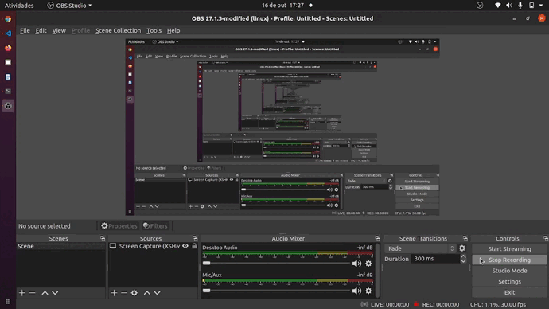

# Relatorio-cotas-vencidas
 

# Sobre o projeto

Projeto desenvolvido para um advogado de condomínio poder acompanhar os devedores do condomínio.

## Layout web

# Tecnologias utilizadas
- Python 
- Selenium
- Beautiful Soup

# Como executar o projeto

Esse projeto é apenas uma demonstração do programa. Não é possível executar.
Pois para executa-lo é necessário adequar a sua realidade.

# Autor

Luan Rodrigues Petruitis

https://www.linkedin.com/in/luanpetruitis/